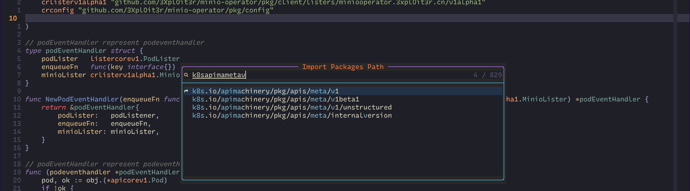

## fork from: https://github.com/haya14busa/gopkgs 

## gopkgs - List Go packages FAST by using the same implementation as [goimports](https://godoc.org/golang.org/x/tools/cmd/goimports)


[](https://travis-ci.org/3Xpl0it3r/gopkgs)
[](https://ci.appveyor.com/project/3Xpl0it3r/gopkgs)
[](https://github.com/3Xpl0it3r/gopkgs/releases)
[](LICENSE)
[](https://godoc.org/github.com/3Xpl0it3r/gopkgs)

gopkgs outputs list of importable Go packages.

By using the same implementation as [goimports](https://godoc.org/golang.org/x/tools/cmd/goimports),
it's faster than [go list ...](https://golang.org/cmd/go/#hdr-List_packages) and it also has `-f` option.

gopkgs cares .goimportsignore which was introduced by https://github.com/golang/go/issues/16386
since it uses the same implementation as [goimports](https://godoc.org/golang.org/x/tools/cmd/goimports).


Sample usage of gopkgs with other tools like [godoc](https://godoc.org/golang.org/x/tools/cmd/godoc) and filtering tools ([peco](https://github.com/peco/peco)).

Here I modified some code, add some functionnal code for gomod support , also  remove many code for some functionnal are unnecessary when we writing code with vim/nvim.


### Installation

#### Install Binary from GitHub Releases

https://github.com/3Xpl0it3r/gopkgs/releases

#### go get

```
go get -u github.com/3Xpl0it3r/gopkgs/cmd/gopkgs
```

### SYNOPSIS
> In fact we don't need this to list all importpakcage. You may need use `go list ./...` for this ;
> This tools should be used with neovim for `go list ` are too slow.
```
➜  gopkgs git:(master) gopkgs -h
Usage of gopkgs:
  -include-name
    	fill Pkg.Name which can be used with -f flag
  -no-vendor
    	exclude vendor dependencies except under workDir 

Use -f to custom the output using template syntax. The struct being passed to template is:
	type Pkg struct {
		Dir             string // absolute file path to Pkg directory ("/usr/lib/go/src/net/http")
		ImportPath      string // full Pkg import path ("net/http", "foo/bar/vendor/a/b")
		ImportPathShort string // vendorless import path ("net/http", "a/b")

		// It can be empty. It's filled only when -include-name flag is true.
		Name string // package name ("http")
	}

```

### Vim


```lua 
function _G._Go_Package_Complete()
    local get_pkgs = function()
        local results = {}
        local list_pkg = io.popen("gopkgs"):read("*all")
        for line in list_pkg:gmatch("[^\n\r]+") do
            table.insert(results, line)
        end
        return results
    end

    local co = coroutine.create(function()
        local selectco = assert(coroutine.running(), 'main thread!')
        local items = get_pkgs()
        vim.ui.select(items, { prompt = "Import Packages Path" }, function(choice)
            coroutine.resume(selectco, choice)
        end)
        local value = coroutine.yield()
        -- if cancel when select , then skip the following step, only return
        if (value == nil or value == '') then
            return
        end

        local inputco = coroutine.running()
        vim.ui.input({ prompt = "Input Alias Pkg Name:" }, function(input)
            coroutine.resume(inputco, input)
        end)
        local aliase = coroutine.yield()

        local pos = vim.api.nvim_win_get_cursor(0)[2]
        local line = vim.api.nvim_get_current_line()
        local next_line = line:sub(0, pos + 1) .. "\t" .. aliase .. "\"" .. value .. "\"" .. line:sub(pos + 2)
        vim.api.nvim_set_current_line(next_line)
        vim.lsp.buf.formatting()
    end)
    coroutine.resume(co)
end

vim.keymap.set("n", "<leader>lI", "<cmd>lua _Go_Package_Complete()<cr>", { desc = "Import Package" })

```

### LICENSE

[](LICENSE)

#### under [x/tools/imports/](x/tools/imports/) directory

```
Copyright (c) 2009 The Go Authors. All rights reserved.

Redistribution and use in source and binary forms, with or without
modification, are permitted provided that the following conditions are
met:

   * Redistributions of source code must retain the above copyright
notice, this list of conditions and the following disclaimer.
   * Redistributions in binary form must reproduce the above
copyright notice, this list of conditions and the following disclaimer
in the documentation and/or other materials provided with the
distribution.
   * Neither the name of Google Inc. nor the names of its
contributors may be used to endorse or promote products derived from
this software without specific prior written permission.

THIS SOFTWARE IS PROVIDED BY THE COPYRIGHT HOLDERS AND CONTRIBUTORS
"AS IS" AND ANY EXPRESS OR IMPLIED WARRANTIES, INCLUDING, BUT NOT
LIMITED TO, THE IMPLIED WARRANTIES OF MERCHANTABILITY AND FITNESS FOR
A PARTICULAR PURPOSE ARE DISCLAIMED. IN NO EVENT SHALL THE COPYRIGHT
OWNER OR CONTRIBUTORS BE LIABLE FOR ANY DIRECT, INDIRECT, INCIDENTAL,
SPECIAL, EXEMPLARY, OR CONSEQUENTIAL DAMAGES (INCLUDING, BUT NOT
LIMITED TO, PROCUREMENT OF SUBSTITUTE GOODS OR SERVICES; LOSS OF USE,
DATA, OR PROFITS; OR BUSINESS INTERRUPTION) HOWEVER CAUSED AND ON ANY
THEORY OF LIABILITY, WHETHER IN CONTRACT, STRICT LIABILITY, OR TORT
(INCLUDING NEGLIGENCE OR OTHERWISE) ARISING IN ANY WAY OUT OF THE USE
OF THIS SOFTWARE, EVEN IF ADVISED OF THE POSSIBILITY OF SUCH DAMAGE.
```

gopkgs copied and modified https://godoc.org/golang.org/x/tools/imports to export some interface
in accordance with LICENSE.

If The Go Authors provide goimports's directory scanning code as a library, I plan to use it.
ref: https://github.com/golang/go/issues/16427

### :bird: Author
haya14busa (https://github.com/haya14busa)

